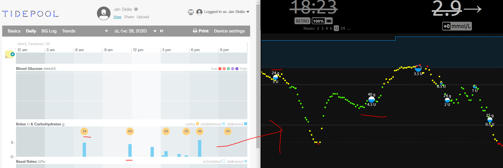

# Tidepool to NightScout sync tool
This tool helps syncing data from **Tidepool** to **NightScout**. Currently normal bolus, carbs, physical activity, basal schedules, bg targets, carb ratios and insulin sensitivities are supported.


## What is Tidepool
Tidepool is a nonprofit organization dedicated to making diabetes data more accessible, actionable, and meaningful for people with diabetes, their care teams, and researchers.
[More](https://www.tidepool.org/)

## What is NightScout
Nightscout (CGM in the Cloud) is an open source, DIY project that allows real time access to a CGM data via personal website, smartwatch viewers, or apps and widgets available for smartphones.

Nightscout was developed by parents of children with Type 1 Diabetes and has continued to be developed, maintained, and supported by volunteers. 
[More](http://www.nightscout.info/)

## Build and run on your device
1. Install .NET Core SDK for your platform ([Linux](https://docs.microsoft.com/en-us/dotnet/core/install/linux), [Windows](https://docs.microsoft.com/en-us/dotnet/core/install/windows?tabs=netcore31), [macOS](https://docs.microsoft.com/en-us/dotnet/core/install/macos))
2. Navigate to `TidepoolToNightScoutSync.APP` folder
3. Open file `appsettings.json`
4. Change items below and fill in your user credentials
   * tidepool:Username = your tidepool username
   * tidepool:Password = your tidepool password
   * nightscout:BaseUrl = your tidepool password
   * nightscout:ApiKey = your NightScout API KEY
   * sync:since = since when the data should be imported (optional, can be null)
   * sync:till = till when the data should be imported (optional, can be null)
 ### Example configuration
 ```js
 {
"tidepool:Username": "tidepool@username.com",
"tidepool:Password": "password",
"nightscout:BaseUrl": "https://skalich.herokuapp.com",
"nightscout:ApiKey": "123456789101112",
"sync:since": "2020-07-01",
"sync:till": null
}
```
1. Open command prompt in the folder and run the app using `dotnet run`
2. You should now see your data in NightScout

## Run using only CMD
Good for AdHoc syncing.
1. Navigate to `TidepoolToNightScoutSync.APP` folder
2. Run command `dotnet run -- tidepool:Username="tidepool@username.com" tidepool:Password="password" nightscout:BaseUrl="https://skalich.herokuapp.com" nightscout:ApiKey="123456789101112" sync:since="2020-07-31"`
   * This will sync all date since 31st of July 2020
   * It will also use Tidepool username, password and NightScout base url, API Secret from the command

## Sync values from Today
Good for AdHoc syncing.
1. Navigate to `TidepoolToNightScoutSync.APP` folder
2. Run command `dotnet run -- tidepool:Username="tidepool@username.com" tidepool:Password="password" nightscout:BaseUrl="https://skalich.herokuapp.com" nightscout:ApiKey="123456789101112"`
   * This will sync all data from Today
   * Notice that **sync:since** is missing

## Sync values from any date
If you have filled your user credentials in `appsettings.json` you don't have to mention them when running the app using CMD.
1. Navigate to `TidepoolToNightScoutSync.APP` folder
2. Run command `dotnet run -- sync:since="2020-07-31"`
   * This will sync all date since 31st of July 2020
   * Rest of the configuration is loaded from `appsettings.json`